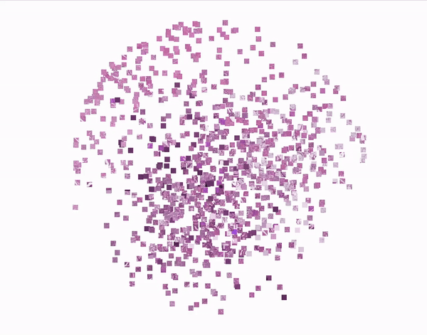

# Pathology t-SNE simulation

This repository contains a simple demonstration of how t-SNE can be used to 
represents different tissue types in histopathological images.

## Stack

For this demonstration I used Jupyter Notebook to make it easy for others to reproduce.
I also used the following Python packages:
* [TensorBoard](https://pypi.org/project/tensorboard/) (with [Embedding Projector](https://www.tensorflow.org/tensorboard/tensorboard_projector_plugin) plugin)
* [medmnist](https://pypi.org/project/medmnist/) (to access the [MedMNIST](https://medmnist.com) histopathology image dataset)
* [Pillow](https://pypi.org/project/pillow/)
* [NumPy](https://pypi.org/project/numpy/)

## Getting started

To recreate a similar video to the one above, you can simply run the Jupyter Notebook (see under `assets/`).  
Note that you may need to run the last cell a few times before the TensorBoard dashboard shows.  
When it opens, enable **Spherizie Data** by clicking the checkbox on the left-hand sidebar.  
Then click the **T-SNE** option underneath. This should start the simulation immediantly.  
Then just play around with hyperparameters to get a simulation you are pleased with.

For the actual recording, I used screen recording on my macOS 14.6 using `CTRL + SHIFT + 5`
and selecting a window, but use whichever tool you prefer :]

To convert recording to GIF, use any video converter like [ezgif](https://ezgif.com/video-to-gif) or similar.

## Citation

If you use this illustration in a presentation or publication, please cite it using the repository URL.

## Acknowledgements

Implementations were based on the code provided in [this blog post](https://learnopencv.com/t-sne-t-distributed-stochastic-neighbor-embedding-explained/).

## License

This project has MIT license.
